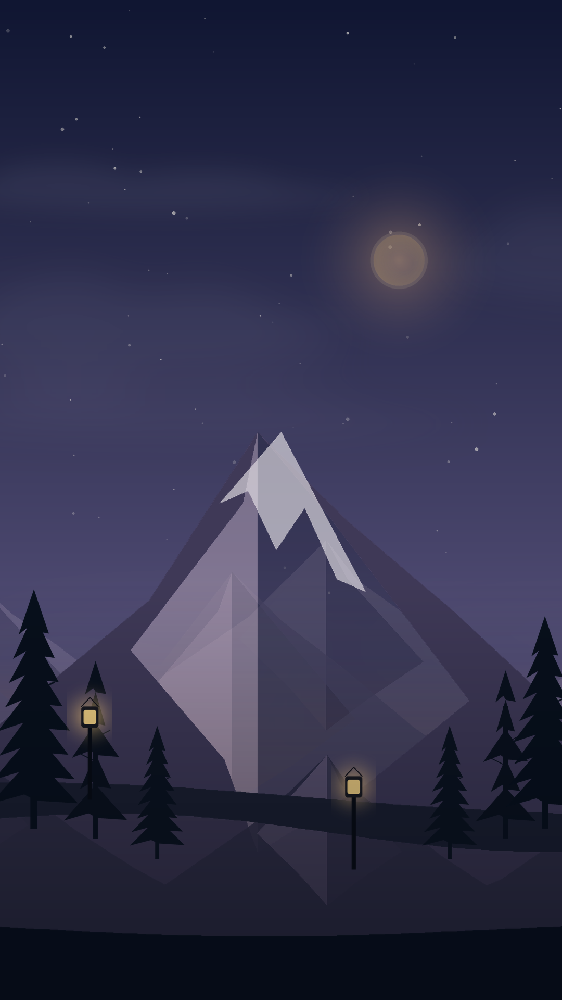

# AetherScape

**AetherScape v0.9.0-beta.12** es un fondo de pantalla vivo climático para Android con paisaje 2D por capas, ciclo horario, estaciones y clima real.



## Novedad principal: optimización profunda

Esta actualización conserva el diseño gráfico de beta 11, pero sustituye el flujo de renderizado pesado por un sistema adaptativo:

- Las ilustraciones grandes se decodifican según dónde se usan: alta definición para el fondo aplicado y una copia ligera para la miniatura.
- La montaña protagonista mantiene una fuente de mayor resolución.
- El cielo, montañas lejanas y bosques se componen en una caché del tamaño exacto de la pantalla y se actualizan a una frecuencia apropiada para su movimiento lento.
- El primer plano, la lluvia, la nieve, las luces y la interacción continúan animándose de forma independiente.
- Solo se dibujan las repeticiones de capa que realmente entran en el campo de visión.
- Los filtros de color se reutilizan, en lugar de recrearse en cada fotograma.
- Las preferencias se consultan una vez por segundo o inmediatamente cuando cambian, no 15–60 veces por segundo.
- La carga de texturas ocurre en hilos secundarios; abrir la aplicación ya no debe bloquear el launcher ni la interfaz de Android.
- La vista previa baja a 15 FPS cuando está tranquila, sube hasta 24 FPS al interactuar y se detiene completamente al ocultar la aplicación.
- El fondo aplicado ajusta temporalmente sus FPS según lluvia, viento e interacción, sin reducir su resolución.
- El servicio deja de renderizar por completo cuando el fondo no es visible.

## Memoria

Las capas de beta 11 podían superar aproximadamente **500 MB decodificados por renderer**. Beta 12 utiliza perfiles de decodificación separados y una miniatura mucho más ligera. Además, existe un pool con conteo de referencias para evitar duplicados idénticos dentro del mismo proceso.

## Calidad visual preservada

La optimización no cambia la resolución de salida de Android. La composición final sigue renderizándose al tamaño real de la superficie del fondo. La reducción se aplica a fuentes sobredimensionadas, trabajo duplicado y frecuencia de capas lentas.

## Motor

```text
MainActivity / preview eficiente
          └── LayeredCanvasRenderer
              ├── caché de fondo a resolución de pantalla
              └── primer plano y clima en tiempo real

WallpaperService / hilo dedicado
          └── LayeredCanvasRenderer
```

El servicio utiliza `lockHardwareCanvas()` y recurre a `lockCanvas()` si el dispositivo no admite la ruta acelerada.

## Clima

- Open-Meteo, sin clave.
- Google Weather API.
- OpenWeatherMap.
- WeatherAPI.com.

## Actualización sobre versiones anteriores

Se conserva exactamente el mismo `applicationId`, `versionCode` ascendente y keystore beta usado desde beta 10. Por ello, beta 12 puede instalarse encima de beta 10 o beta 11 sin desinstalar, siempre que la APK anterior haya sido firmada con esa misma clave.

## Publicar desde Termux

```bash
cd "$HOME"
rm -rf "$HOME/AetherScape-release"
mkdir -p "$HOME/AetherScape-release"

unzip -o \
  "$HOME/storage/downloads/AetherScape-v0.9.0-beta.12-deep-optimization-source.zip" \
  -d "$HOME/AetherScape-release"

cd "$HOME/AetherScape-release/AetherScape-beta"
bash scripts/validate.sh
bash scripts/publish-termux.sh AetherScape v0.9.0-beta.12
```

Para consultar GitHub Actions:

```bash
OWNER="$(gh api user --jq .login)"
gh run list --repo "$OWNER/AetherScape" --limit 5
```

La validación local comprueba estructura, XML, recursos PNG, continuidad del keystore y presencia de las optimizaciones. La compilación Android completa se ejecuta en GitHub Actions.
