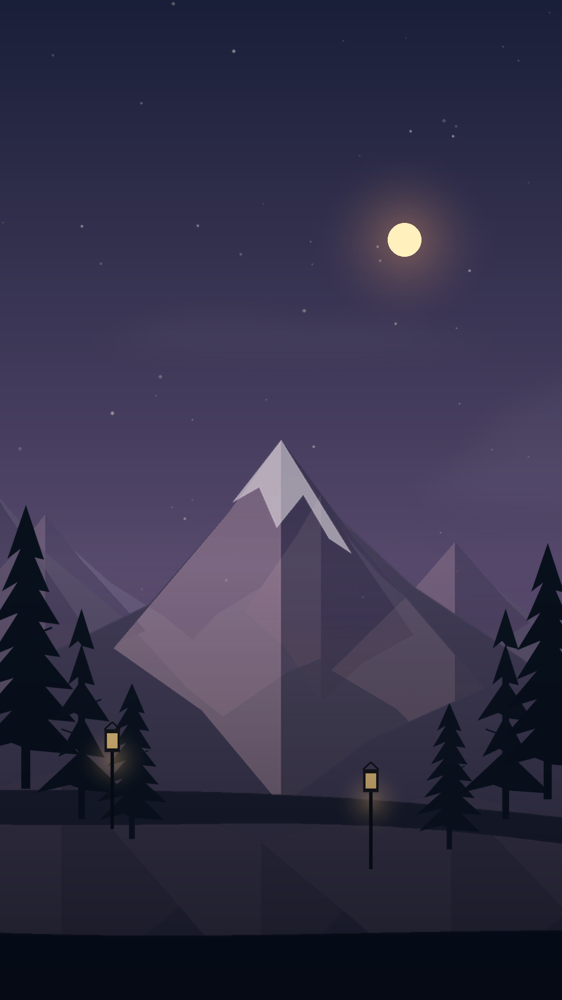

# AetherScape

**AetherScape v0.6.0-beta.7** es una aplicación Android de fondo vivo climático con paisaje 2D por capas, transiciones horarias, estaciones y varios proveedores meteorológicos.



## Cambio principal de esta versión

La beta anterior renderizaba el fondo aplicado mediante un servicio libGDX/OpenGL separado de la vista previa. En algunos dispositivos el selector aceptaba el fondo, pero el servicio gráfico quedaba negro.

Esta versión usa un único motor nativo compartido:

```text
MainActivity / vista previa
          └── LayeredCanvasRenderer
WallpaperService / pantalla de inicio
          └── LayeredCanvasRenderer
```

El servicio dibuja directamente sobre la superficie oficial de `WallpaperService`, usando `lockHardwareCanvas()` cuando el dispositivo lo permite y `lockCanvas()` como respaldo.

## Mejoras visuales

- Árboles distribuidos mediante plantillas de escena, no aleatoriamente por toda la pantalla.
- Grupos de bosque en los bordes y una zona central libre para la montaña principal.
- Cinco tipos de segmento: vista abierta, entrada de bosque, sendero con faroles, claro y cresta dispersa.
- Montañas cercanas más anchas y menos puntiagudas.
- Bosques lejanos agrupados con claros visibles.
- Misma altura lógica de `1000` unidades en vertical y horizontal.
- Sol, luna, faroles y fogatas con iluminación radial suave.
- Niebla, lluvia, nieve, viento, estrellas y luciérnagas animados.
- Colores estacionales aplicados a bosques y montañas.

## Correcciones del fondo aplicado

- El componente que abre Android ahora es `AetherWallpaperService`.
- Se conserva un alias de migración para el componente de la beta 0.5, evitando que una actualización deje el fondo anterior sin servicio.
- El manifiesto registra el mismo servicio que usa el botón **Aplicar como fondo de pantalla**.
- Se dibuja un primer fotograma al crear la superficie, incluso antes de que el launcher marque el fondo como visible.
- Si el Canvas acelerado no está disponible, se utiliza Canvas convencional.
- Si una capa falla, se dibuja una escena de emergencia en lugar de dejar la pantalla negra.
- Toques, desplazamiento del launcher y cambios de ajustes fuerzan un nuevo fotograma.

## Clima

Proveedores compatibles:

- Open-Meteo, sin clave.
- Google Weather API.
- OpenWeatherMap.
- WeatherAPI.com.

## Compilar y publicar desde Termux

```bash
cd "$HOME"
rm -rf "$HOME/AetherScape-release"
mkdir -p "$HOME/AetherScape-release"

unzip -o \
  "$HOME/storage/downloads/AetherScape-v0.6.0-beta.7-native-layer-fix-source.zip" \
  -d "$HOME/AetherScape-release"

cd "$HOME/AetherScape-release/AetherScape-beta"
bash scripts/validate.sh
bash scripts/publish-termux.sh AetherScape v0.6.0-beta.7
```

Para vigilar GitHub Actions:

```bash
OWNER="$(gh api user --jq .login)"
gh run list --repo "$OWNER/AetherScape" --limit 5
```

## Estado beta

La estructura, XML, recursos PNG y scripts se validan localmente. La compilación Android completa se ejecuta en GitHub Actions.
